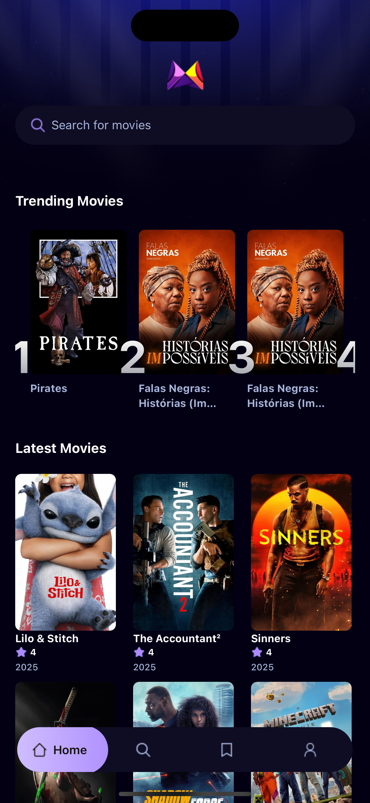

# Movies App

Mobile application that integrates with [TMDB](https://www.themoviedb.org/) and [AppWrite](https://appwrite.io/) to build a movies search app that storage research statistics.

## Get started

1. Install dependencies

   ```bash
   npm install
   ```

2. Start the app

   ```bash
   npx expo start
   ```

## Demo

<p align="center>



<br />


</p>